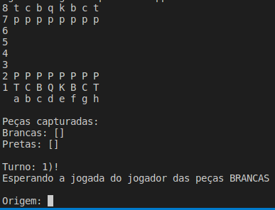

## Projeto Xadrez

Este projeto é jogo de xadrez baseado no projeto desenvolvido em um curso de Java que fiz em 2023.

O jogo possui uma interface gráfica no prompt de comando. Sendo as entradas e saída feitas somente pelo terminal.

As peças brancas são identificadas por letras maiúsculas enquanto as peças pretas são identificadas por letras minúculas.

Legenda das peças:
P/p -> Peão
T/t -> Torre
C/c -> Cavalo
B/b -> Bispo
Q/q -> Rainha (Queen)
K/k -> Rei (King)

As regras do jogo podem ser conferidas em [Regras do Jogo](Regras_Xadrez.pdf)

A estrutura do jogo foi baseada no diagrama 

Esto jogo de Xadrez foi uma adaptação do jogo feito em um curso de Java, houve algumas modificações como mudança de nomes de métodos, melhorias na lógica de programação, etc. Todavia a idea e organização do projeto são as mesma do projeto apresentado no curso.